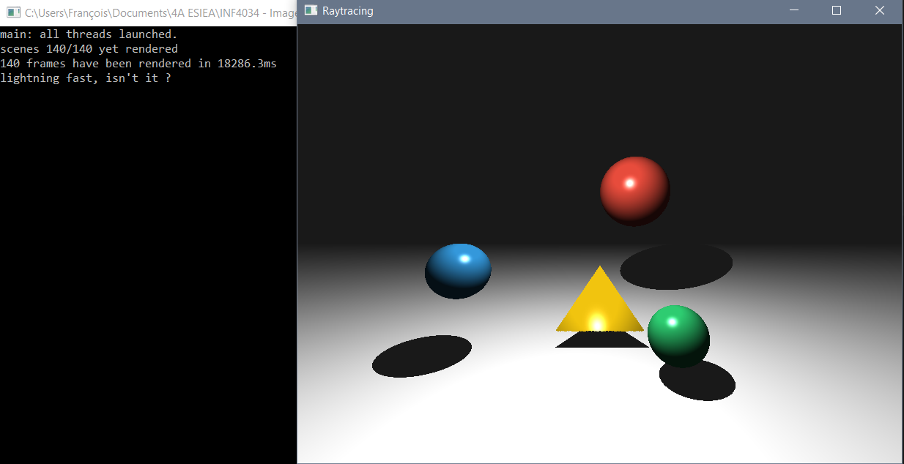

# Imagerie Numérique - Algorithme de raytracing
Le but de ce projet a été d'implémenter un système de rendu 3D par lancer de rayon avec les spécificités suivantes:  

- Effectuer un lancer de rayon avec un modèle de matériau de Blinn-Phong ;
- Gérer les sphères, plans et faces triangulaires comme primitives ;
- Sauvegarder cette image dans un fichier de sortie.

Le projet a été codé en C++, avec le logiciel Visual Studio 2013. Il utilise **FreeImage** pour l'enregistrement de l'image ainsi que **SDL 2.0** pour afficher le rendu directement dans la fenêtre du programme, et a été optimisé en faisant appel à du **multithreading basique**.

Grâce au multithreading, il est possible de générer plusieurs scènes en parallèle et donc de proposer **une animation** à l'utilisateur. En moyenne, il était possible de générer **140 scènes en ~20sec** (sur un Intel i5, quad core).

Le temps réel a néanmoins  été écarté car l'algorithme de lancer de rayon n'est tout simplement pas assez performant.

### Aperçu du résultat obtenu

## Architecture du projet

* **Scene**: classe principale qui possède `render()`, la méthode implémentant l'algorithme de lancer de rayons et `save()` permettant de sauvegarder l'image dans un fichier.
* **Camera**: calcule la dimension de l'écran à afficher et où l'afficher.
* **Light**: calcule les différentes types de lumières (ambiante, diffuse, spéculaire).
* **Objets**:
    - **Object**: classe mère contenant la position de tout objet et l'abstraction de la méthode de lancer de rayon `intersect()`
    - **Plane**: contient l'intersection rayon/plan
    - **Sphere**: contient l'intersection rayon/sphère et la simulation de gravité
    - **Triangle**: contient l'intersection rayon/tiangle
    - **Pyramid**: se base sur l'intersection de 4 triangles pour calculer l'intersection rayon/pyramide
* **Outils**:
    - **Vec4**: support de calcul géométrique entre vecteurs 
    - **Vec4N**: vecteurs normalisés
    - **Mat4**: support de calcul matriciel, utilisé pour les rotation de vecteurs en 3D
    

La scene ne peut actuellement n'avoir qu'une seule caméra. Elle peut par contre supporter plusieurs lumières, mais cette fonctionnalité n'a pas été complètement implémentée.